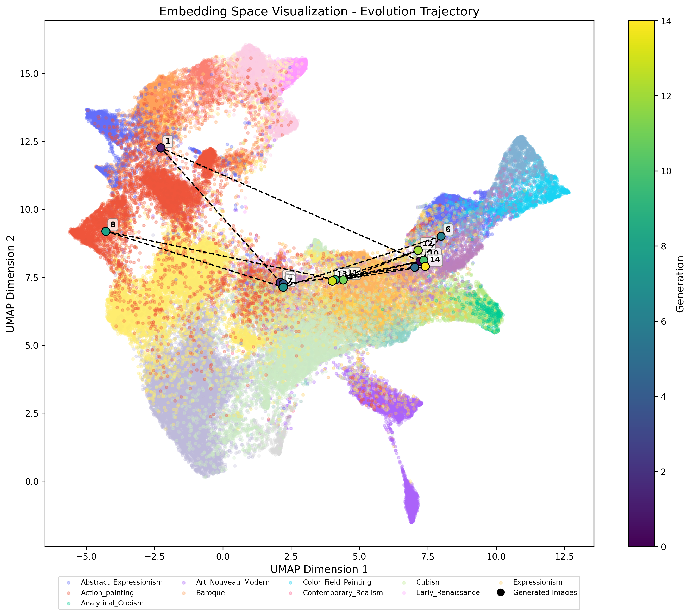

# Art-Evolution


We use an evolutionary approach to discover novel and interesting conceptual combinations in visual art. We use LLMs (GPT-4o) as the mutation operator, i.e. it will propose new concepts and recombine them with previous concepts to create novel artworks. In each generation, we evaluate the fitness of the artwork and give this feedback to the LLM to guide the search to novel artworks. This approach is inspired by [Discovering Preference Optimization Algorithms with and for Large Language Models](https://arxiv.org/abs/2406.08414) but adapted to the visual art domain and concept recombination.

Each generation, the LLM selects which concepts to introduce and how many to add to the concept pool. It then recombines concepts from the pool to generate a prompt for DALL-E 3 (with GPT-4o image generation coming soon). The resulting image, along with the selected concepts, is evaluated using a fitness function to determine its quality and novelty.  

To maintain diversity, if a concept fails to improve fitness after *n* generations, it expires and is removed from the pool, preventing the LLM from using it in future generations.

Specifically, the fitness function is a combination of the following metrics:
- Aesthetic score: *How aesthetically pleasing is the artwork?* We use the [Aesthetic Predictor model](https://github.com/discus0434/aesthetic-predictor-v2-5) to score the artwork.
- Originality: *How original is the artwork compared to WikiArt artworks?* We use a fine-tuned ResNet152 to extract features from the artwork and then we measure the closest match to the features of WikiArt artworks.
- Diversity: *How diverse are the concepts used in the artwork?* We compute the average cosine similarity between the concepts used in the artwork.

The code has several visualizations to analyze the evolution, as the trajectory of the images in the UMAP space of Wikiart artworks:



**Note: This is not the final version. We are working in improvements and fixes in both the plots and the overall logic.**

## Setup

Create a virtual environment and install the requirements:

```bash
python -m venv .venv
source .venv/bin/activate
pip install -r requirements.txt
```
Add your OpenAI API key to the `OPENAI_API_KEY` environment variable:

```bash
export OPENAI_API_KEY=<your-openai-api-key>
```

## Required Assets

For fitness calculation (originality function), this project requires large asset files that are not included in the repository:

1. `embeddings.npy` (~600MB): Pre-computed embeddings for WikiArt styles
2. `best_model_resnet_152.pth` (~230MB): Trained ResNet model for embedding generation

If you don't want to download the assets, you can run the art evolution selecting only the aesthetic function as fitness: 

```bash
python art_evolution/run_evolution.py --concepts mountain --num-generations 10 --fitness-function aesthetic
```

### Download Instructions

Before running the evolution using originality, you need to download these files:

1. **Automatic Download**:
   ```bash
   # Run the download script to get all required files
   python download_from_release.py
   ```

2. **Manual Download**:
   - Go to the [Releases page](https://github.com/alejandrohdez00/art-evolution/releases/tag/v1.0.0)
   - Download both files from the release
   - Place them in the `assets/embedding/` directory

## Run
To run the art evolution, use the following command:

```bash
python art_evolution/run_evolution.py --concepts mountain --num-generations 10
```

The `--concepts` argument specifies the set of concepts for which you want to discover novel combinations. These concepts are the original concepts and will be always used in the images.
When the `--historical-information` argument is introduced, in each generation the LLM will be given also information about which concept has been proven to be more effective during the run. Note that this can bias more the search to concepts that usually worked well.
Using `--max-unsuccesful-uses`you can define the number of failed attempts before a concept is discarded from the pool of usable concepts.

You can select to use a single fitness function (aesthetic, originality, diversity) using `--fitness-function`. By default, the fitness function considers the three measures.

*Note: For faster fitness computation, use GPU. If you cannot access a GPU, use art evolution with aesthetic function as fitness*

*Note2: Currently, DALL-E 3 is used to generate the images. We have seen that sometimes it generates bad images when the prompt is complex. We will add the new GPT-4o image generation as soon as it is available.*

